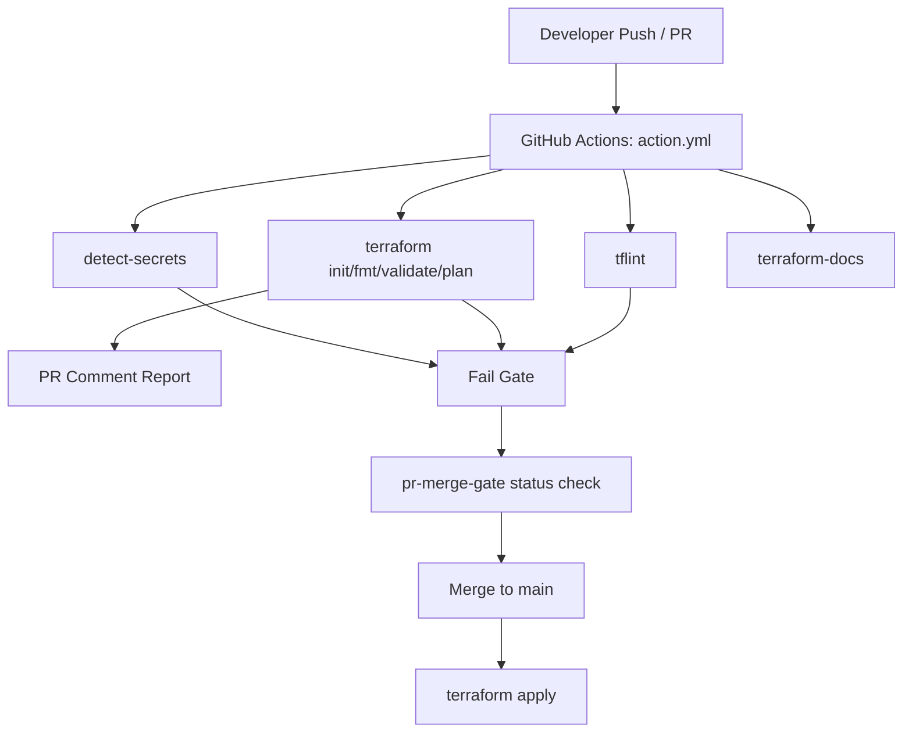

# GH-actions-terraform

[](https://github.com/ldpacl/GH-actions-terraform/actions/workflows/action.yml)
[](https://developer.hashicorp.com/terraform)
[](https://registry.terraform.io/providers/hashicorp/aws/latest)
[](https://github.com/terraform-linters/tflint)
[](https://github.com/terraform-docs/terraform-docs)

Terraform CI/CD workflow using GitHub Actions, including formatting checks, linting, secret scanning, PR status reporting, merge gating, docs automation, and controlled apply on `main`.

## Table of Contents

- [Architecture](#architecture)
- [Workflow Overview](#workflow-overview)
- [Prerequisites](#prerequisites)
- [Getting Started](#getting-started)
- [GitHub Secrets Setup (AWS)](#github-secrets-setup-aws)
- [Configuration Guide](#configuration-guide)
- [Contributing](#contributing)
- [Troubleshooting](#troubleshooting)

## Architecture



If your Markdown preview does not support Mermaid, use this text diagram:

```text
Developer Push / PR
        |
        v
GitHub Actions (action.yml)
   |        |         |         |
   v        v         v         v
detect-  terraform   tflint  terraform-docs
secrets  checks
   \        |         /
    \       |        /
     +------v-------+
         Fail Gate
             |
             v
      pr-merge-gate
             |
             v
       Merge to main
             |
             v
       terraform apply
```

## Workflow Overview

Workflow file: `.github/workflows/action.yml`

### Triggers

- `pull_request` to `main` on Terraform path changes (validation and reporting)
- `push` to `main` on Terraform path changes (apply)

### Jobs

#### `terraform`

Main CI/CD job running on `ubuntu-latest`:

1. Checkout target branch
2. Secret scan (`detect-secrets`)
3. Terraform setup
4. `terraform init`
5. `terraform fmt -check -diff -recursive`
6. TFLint setup and lint run using `resources/tflint.hcl`
7. `terraform validate`
8. Update root `README.md` via `terraform-docs`
9. `terraform plan` (PR only)
10. Sticky PR status comment with outcomes + logs
11. Fail step if any required checks fail
12. `terraform apply` on `push` to `main`

#### `pr-merge-gate`

- Depends on `terraform` job
- Fails unless all required checks in `terraform` passed
- Recommended as required branch protection check for `main`

## Prerequisites

To run this workflow successfully, keep the following files in `resources/`:

- `resources/tflint.hcl` - TFLint plugins and rules
- `resources/.terraform-docs.yml` - terraform-docs rendering behavior
- `resources/TEMPLATE.md` - README preface content rendered before generated Terraform docs

If you are bootstrapping another repository, you can clone/copy these three files as starter templates and customize them per project.

## Getting Started

1. Create a feature branch.
2. Make Terraform changes under `terraform/`.
3. Run local checks before pushing:

```bash
terraform -chdir=terraform init
terraform -chdir=terraform fmt -recursive
terraform -chdir=terraform validate
```

4. Open a PR to `main`.
5. Review the CI comment for detailed pass/fail status and logs.
6. Merge only after `terraform-merge-gate` is green.

## GitHub Secrets Setup (AWS)

Configure repository secrets at:

`Settings -> Secrets and variables -> Actions -> New repository secret`

Required secrets:

- `AWS_ACCESS_KEY_ID`
- `AWS_SECRET_ACCESS_KEY`
- `BUCKET_TF_STATE`

### Recommended IAM baseline

Use a dedicated CI principal (user/role), not personal or root credentials.

Minimum capabilities usually include:

- S3 state bucket access (`GetObject`, `PutObject`, `ListBucket`, optional `DeleteObject`)
- Infrastructure-specific permissions for resources managed in `terraform/`
- Optional DynamoDB lock table permissions if state locking is used

## Configuration Guide

### TFLint (`resources/tflint.hcl`)

You can tune:

- plugin versions and sources
- rule enable/disable behavior
- naming conventions

After changes, re-run CI and verify `tflint --init` + lint pass.

### terraform-docs (`resources/.terraform-docs.yml`)

You can tune:

- section ordering and visibility
- output template markers
- rendering options (anchors, required flags, sensitive/type output)

To regenerate root docs locally:

```bash
terraform-docs markdown table terraform --config resources/.terraform-docs.yml > README.md
```

### Template (`resources/TEMPLATE.md`)

This file is rendered above generated Terraform docs in `README.md`.
Use it for:

- architecture and standards
- onboarding notes
- contribution and operational guidance

## Contributing

1. Fork or branch from `main`.
2. Keep changes scoped and atomic.
3. Run local checks (`fmt`, `validate`, optional `tflint`).
4. Update docs when Terraform inputs/outputs/resources change.
5. Open PR with summary, test evidence, and rollout notes.
6. Address CI and review feedback.

### Pull Request Checklist

- [ ] Terraform files are formatted
- [ ] Validation passes
- [ ] TFLint passes
- [ ] No secrets introduced
- [ ] README reflects current Terraform docs

## Troubleshooting

- **Provider version mismatch (`managed by newer provider`)**
  - Update provider constraints and commit `terraform/.terraform.lock.hcl`.
- **TFLint plugin not found**
  - Ensure plugin `source` and `version` are present in `resources/tflint.hcl`.
- **detect-secrets regex failures**
  - `--exclude-files` takes regex, not glob syntax.
- **fmt drift in CI**
  - Run `terraform fmt -recursive` locally and commit.

## Security Notes

- Never commit plaintext credentials or `.tfstate` files.
- Prefer short-lived credentials (OIDC role assumption) over long-lived keys for production use.
- Review PR comment logs before merging when checks fail.

## Requirements

| Name | Version |
|------|---------|
| <a name="requirement_terraform"></a> [terraform](#requirement\_terraform) | >= 1.6.0 |
| <a name="requirement_aws"></a> [aws](#requirement\_aws) | ~> 6.0 |

## Providers

| Name | Version |
|------|---------|
| <a name="provider_aws"></a> [aws](#provider\_aws) | 6.41.0 |

## Modules

No modules.

## Resources

| Name | Type |
|------|------|
| [aws_s3_bucket.host-bucket](https://registry.terraform.io/providers/hashicorp/aws/latest/docs/resources/s3_bucket) | resource |
| [aws_s3_bucket_ownership_controls.ownership](https://registry.terraform.io/providers/hashicorp/aws/latest/docs/resources/s3_bucket_ownership_controls) | resource |
| [aws_s3_bucket_policy.host-bucket-policy](https://registry.terraform.io/providers/hashicorp/aws/latest/docs/resources/s3_bucket_policy) | resource |
| [aws_s3_bucket_public_access_block.public_access](https://registry.terraform.io/providers/hashicorp/aws/latest/docs/resources/s3_bucket_public_access_block) | resource |
| [aws_s3_bucket_website_configuration.website](https://registry.terraform.io/providers/hashicorp/aws/latest/docs/resources/s3_bucket_website_configuration) | resource |
| [aws_s3_object.index_file](https://registry.terraform.io/providers/hashicorp/aws/latest/docs/resources/s3_object) | resource |

## Inputs

No inputs.

## Outputs

| Name | Description |
|------|-------------|
| <a name="output_s3_url"></a> [s3\_url](#output\_s3\_url) | Public website endpoint for the S3 bucket. |
